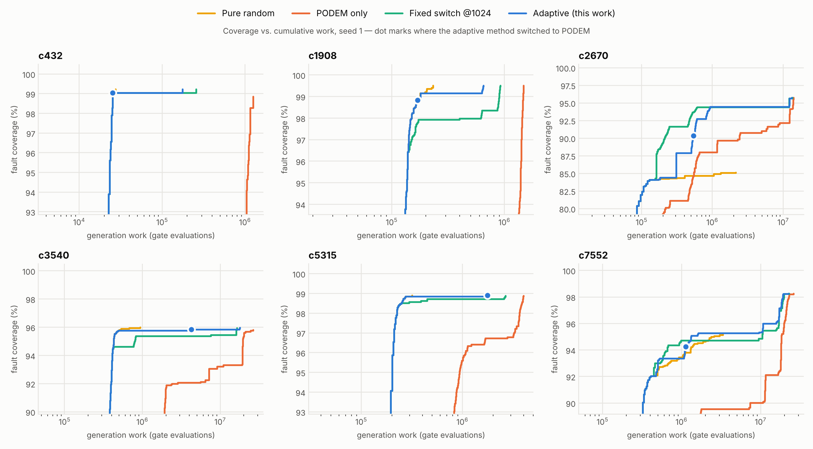

# Adaptive Fault-Coverage-Driven Test Generation for Combinational Circuits

**Bridging Random Testing and Deterministic ATPG**

Course project — Testing of VLSI Circuits (BEVD309L), VIT Vellore
Vidit Narayan Panigrahi (24BVD0167) · Varun V Nair (24BVD0061)

Random patterns detect most stuck-at faults almost for free, then stall on a
residue of random-pattern-resistant faults. Deterministic ATPG (PODEM) can target
that residue but is expensive per fault. Hybrid flows run random patterns first
and hand the rest to ATPG — but *when* to switch is usually a fixed pattern count
chosen in advance, and the best count differs from circuit to circuit.

This project decides the switch point **online**, from the circuit's own coverage
trajectory, with a statistical test: keep generating random patterns while they
are still detecting faults at least as cheaply as PODEM would, and switch as soon
as the data shows they no longer are.

## Results

All 11 ISCAS-85 circuits, 6 methods, 5 seeds each (330 runs). Every method uses the
same collapsed fault list, the same fault simulator and the same PODEM engine, so
differences come only from *when* the switch happens.


Generation work relative to the **best fixed switch point for each circuit, chosen
in hindsight** (an oracle a real flow does not have):

| method | geometric mean | worst circuit |
|---|---:|---:|
| PODEM only | 1.55× | 3.83× (c880) |
| fixed switch @128 | 1.25× | 1.99× |
| fixed switch @1024 | 1.02× | 1.05× |
| fixed switch @8192 | 1.06× | 1.52× |
| **adaptive (this work)** | **1.00×** | **1.02×** |

- The adaptive switch **matches the per-circuit oracle** (0.997× geomean, worst
  case +2.4%) with no per-circuit tuning. Every single fixed N is worse somewhere;
  the best N ranges from 128 (c6288) to 8192 (c1355, c1908, c3540, c5315).
- **Coverage is equal to or better than every other method on every circuit.**
  It is strictly best on c3540 (FC 95.99% vs 95.81% for PODEM only) and c5315.
- Against PODEM alone it gets equal or higher coverage with less work on every
  circuit: 1.55× less on average, from 1.04× (c2670) to 3.7× (c880).
- On wall-clock time the adaptive method ties a well-chosen fixed N=8192 (1.004×
  vs 1.005× geomean). The claim is **robustness without tuning**, not a large
  speed-up over a lucky fixed choice.




The adaptive switch points do not sit exactly on the best fixed N. Near the optimum
the cost curve is flat, so switching at 2,000 or 8,000 patterns on c1355 costs
about the same. What matters is that it never lands where the cost rises steeply.

Full per-circuit tables (FC, FE, aborted faults, compacted test counts, patterns,
PODEM calls, work, time, ± stdev over seeds): [`results/summary_table.md`](results/summary_table.md).
Raw data: `results/summary.csv`, `results/curves/`, decision logs in
`results/decisions/`, adaptive test sets in `results/tests/`.

## How it works

### Fault model — `src/faults.cpp`
Single stuck-at faults on every **stem and fanout branch** (a signal feeding more
than one gate input or output gets a separate line per destination), stuck-at-0
and stuck-at-1 on each, then structural **equivalence collapsing** (AND input SA0 ≡
output SA0, NAND input SA0 ≡ output SA1, and so on). Collapsed fault counts match the
published ISCAS-85 numbers exactly for all 11 circuits (c17 = 22, c432 = 524,
c880 = 942, c6288 = 7744, c7552 = 7550).

### Fault simulation — `src/fault_sim.cpp`
Parallel-pattern single-fault propagation: 64 patterns per pass in 64-bit words, one
fault-free simulation per block, then for each undetected fault an event-driven
re-evaluation of only the gates in its fanout cone whose values change. Detected
faults are dropped.

### PODEM — `src/podem.cpp`
Decisions on primary inputs only. Event-driven 3-valued implication of the good and
faulty machines, D-frontier with an X-path check, SCOAP-guided objective and
backtrace. Two additions that measurably reduced aborts:
- **Reconvergent XORs.** An XOR side input inside the fault cone is set to the value
  its driver produces when *controlled*, so it can be forced by one off-path input
  and cannot carry a cancelling copy of the fault effect.
- **Randomized restarts.** The backtrack budget is split: a short plain attempt, two
  short attempts with perturbed tie-breaking, then a long plain attempt with 3/4 of
  the budget. Long plain searches are what prove redundancy; the randomized ones
  escape a bad early decision. At the same 256-backtrack budget this cut c432
  aborts from 64 to 9 while using less total work.

Exhausting the search proves a fault redundant. Exceeding the budget (default 1024
backtracks) aborts it. Aborted faults stay in fault simulation, so a later vector
can still detect them.

### The switching rule — `src/stagnation.cpp`, `src/atpg_flow.cpp`
After every 64-pattern random block the flow asks: *is random testing still at least
as productive, per unit of work, as PODEM would be on what is left?*

New detections in a window of random patterns are modelled as Poisson. With `k`
detections over `R` work and a break-even yield `y`, H₀ "random still pays" is
rejected when `P(K ≤ k | Poisson(y·R)) < α` (α = 0.05). Windows are not a fixed
length. Each one grows forward from the previous test until `y·R ≥ −2 ln α`, the
smallest window in which seeing zero detections would be significant. Windows do
not overlap, so the early high-yield burst never masks a later stall. Two
consecutive rejections are required, which bounds the false-switch probability per
decision by α².

The break-even yield comes in two stages:
1. **No PODEM calls yet.** A deterministic vector can never cost less than
   fault-simulating it, and that costs about one random block. So PODEM cannot win
   while random still finds about 1 fault per block. The test runs against that bound.
2. **Once that rejects**, a probe of 16 PODEM calls on randomly sampled undetected
   faults measures PODEM's actual yield. Only work on calls that produced a test
   counts, because a random detection saves exactly the PODEM call that would have
   detected that fault. Work spent proving faults redundant is paid whenever the
   switch happens. The yield is re-measured whenever the target set halves. Probe
   vectors are real tests and stay in the test set.

The flow also stops random generation as soon as no PODEM-targetable faults remain.

### Work metric
Generation cost is counted in gate evaluations (a 64-bit word evaluation in the
fault simulator, a 3-valued evaluation in PODEM). This makes every run
deterministic for a given seed. `faultatpg calibrate` measured the ns-per-unit ratio
of the two engines at 0.71–1.29 across c432–c7552, so they are weighted equally.
Wall-clock time is reported alongside.

### Baselines and compaction
`random` (up to 32,768 patterns), `podem` (PODEM on every fault, with fault
dropping), `fixed` (N random patterns, then PODEM), `adaptive`. Every final test set
is re-verified by an independent fault-simulation pass and statically compacted by
reverse-order fault simulation.

## Verification

`make test` runs 847 checks against independent references:

1. the bit-parallel logic simulator matches a scalar simulator on every circuit;
2. c17 has 34 uncollapsed and 22 collapsed faults;
3. every uncollapsed fault behaves identically to its collapsed representative
   (exhaustive on c17, sampled on c432–c880);
4. the parallel fault simulator gives the same first-detecting pattern for every
   fault as a serial full-resimulation reference;
5. every PODEM test detects its target fault under the reference simulator, with
   several random fills of the don't-care inputs (c17–c1908);
6. on 400 random circuits (≈37,000 faults, including XOR/XNOR, reconvergence and
   unobservable logic), PODEM's DETECTED / REDUNDANT verdict matches exhaustive
   simulation for every fault — so redundancy claims are proofs;
7. every method runs end to end and compaction never changes coverage.

## Limitations (stated honestly)

- **PODEM has no learning or dominator analysis.** It cannot prove some redundant
  faults in XOR trees (8 each in c499 and c1355 stay aborted; the literature lists
  them as redundant), and on c3540 it aborts ~76 detectable faults at the default
  limit. The random phase picks most of those up, which is part of why hybrid flows
  exist — but a stronger ATPG engine would shrink the gap between methods.
- Run times are milliseconds to under a second. Differences in wall-clock time are
  small and noisier than the work counts, which is why work is the primary metric.
- The comparison is against fixed switch points 128 / 1024 / 8192 and an oracle
  built from those three. A finer sweep of N would make the oracle slightly stronger.
- The random generator is uniform. The framework accepts any pattern source, but
  weighted or constrained generation was not evaluated.

## Build and run

Requires a C++17 compiler; plotting needs Python 3 + matplotlib.

```bash
make                      # builds ./faultatpg
make test                 # 847 verification checks
make sweep                # all circuits x methods x 5 seeds, then plots (~1 min)
```

```bash
./faultatpg info benchmarks/c432.bench                  # circuit + fault-list stats
./faultatpg sim  benchmarks/c17.bench 01101             # simulate one vector
./faultatpg faults benchmarks/c17.bench                 # list collapsed faults
./faultatpg run  benchmarks/c3540.bench --method adaptive --seed 1
./faultatpg run  benchmarks/c3540.bench --method fixed --switch 1024
./faultatpg run  benchmarks/c3540.bench --method podem --tests out.txt --curve curve.csv
./faultatpg sweep benchmarks results --seeds 5
python3 scripts/plot_results.py results
```

`run` prints the adaptive method's full decision log: every window test with `k`,
the break-even expectation, the p-value, and each probe. Options: `--method`,
`--seed`, `--budget`, `--switch`, `--bt` (backtrack limit), `--alpha`, `--confirm`,
`--probe`, `--warmup`, `--weight`, `--curve FILE`, `--tests FILE`.

## Repository structure

```
vlsi-fault-testing/
├── src/
│   ├── circuit.*     .bench parser, fanouts, Kahn's-algorithm levelization
│   ├── logic.*       gate evaluation (64-bit words, 3-valued), logic simulators
│   ├── faults.*      stem + branch fault list, equivalence collapsing, reference fault sim
│   ├── fault_sim.*   parallel-pattern fault simulator with fault dropping
│   ├── scoap.*       SCOAP controllability / observability
│   ├── podem.*       PODEM with restarts
│   ├── stagnation.*  Poisson window test (the switching rule)
│   ├── atpg_flow.*   random / podem / fixed / adaptive flows, compaction, logging
│   ├── selftest.cpp  verification suite
│   └── main.cpp      command-line driver
├── benchmarks/       all 11 ISCAS-85 circuits in .bench format
├── scripts/
│   ├── verilog2bench.py   ISCAS-85 gate-level Verilog -> .bench
│   └── plot_results.py    plots + summary tables from a sweep
├── results/          sweep output: summary.csv, summary_table.md, plots/, curves/, ...
├── paper/            literature review papers
├── links.txt         reference links
└── Makefile
```

The ISCAS-85 `.bench` files were converted from the original gate-level Verilog
distribution with `scripts/verilog2bench.py`; PI/PO/gate counts match the
canonical netlists, and the converted c17 is identical to the hand-written one.
