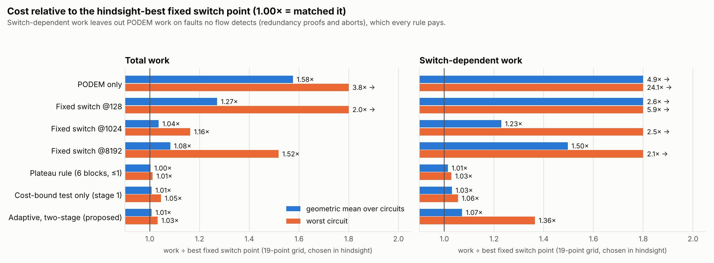
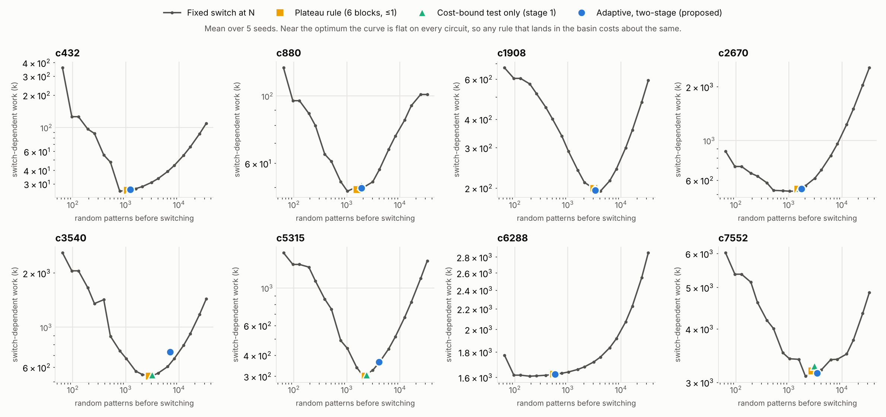
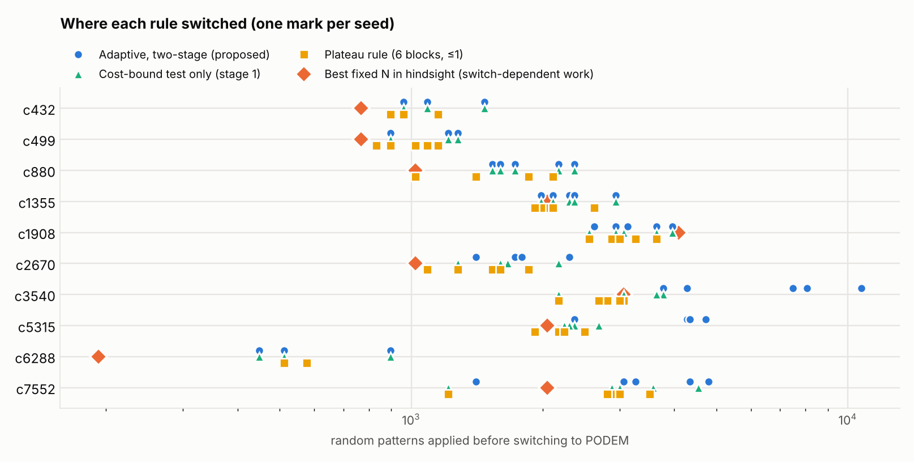

# Adaptive Fault-Coverage-Driven Test Generation for Combinational Circuits

**Bridging Random Testing and Deterministic ATPG**

Course project — Testing of VLSI Circuits (BEVD309L), VIT Vellore
Vidit Narayan Panigrahi (24BVD0167) · Varun V Nair (24BVD0061)

Random patterns detect most stuck-at faults almost for free, then stall on a
residue of random-pattern-resistant faults. Deterministic ATPG (PODEM) can target
that residue but costs much more per fault. Hybrid flows run random patterns
first and hand the rest to ATPG. *When* to switch is usually a fixed pattern
count chosen in advance, and the best count differs from circuit to circuit.

This project decides the switch point **online**, from the circuit's own coverage
trajectory, and asks how much the decision rule matters.

## Findings

All 11 ISCAS-85 circuits, 5 seeds each. Every flow uses the same collapsed fault
list, the same fault simulator and the same PODEM engine, so differences come only
from when the switch happens. Each rule is compared with an **oracle**: the best of
19 fixed switch points (64 to 32,768 patterns), chosen per circuit in hindsight.

1. **A switch rule derived from a cost bound lands within about 1% of the
   oracle on every circuit, with nothing tuned per circuit.** The bound says that
   random patterns cannot be losing to PODEM while they still find about one new
   fault per 64-pattern block of fault-simulation work. The rule tests random's
   detection rate against that bound with a Poisson test.
2. **The full method as proposed adds nothing on ISCAS-85.** It adds a second
   stage that measures PODEM's actual yield before switching. That stage costs
   PODEM calls on a residue that is mostly redundant, and it waits for
   significance in a regime where the two rates are nearly equal. On total work
   it ties switching on the first stage alone (1.007× geomean for both; it is
   about 2% better on c880, 3% worse on c5315). On switch-dependent work it is
   worse (1.07× vs 1.03× geomean, worst 1.36× vs 1.06×).
3. **A plain plateau heuristic does as well as either rule.** The heuristic is:
   switch when 6 blocks found at most 1 fault. Plateau 6/1 is the first stage
   with a sliding window. At α = 0.05 and window μ = 6, the Poisson test rejects
   exactly when k ≤ 1. So the statistics explain *why* this threshold works rather
   than beating it. All six plateau settings tried land within 1% of the oracle on
   total work.
4. **The switch point matters a lot. The fine-grained choice near the optimum
   does not.** Fixed N = 128 costs 1.27× the oracle and PODEM-only costs 1.58×
   (3.8× on c880). But the cost curve is flat around its minimum on every
   circuit (`results/plots/cost_vs_switch.png`), so any rule that lands in the
   basin costs about the same.
5. **Most of the work is not affected by the switch at all.** On 8 of 10
   circuits, 77–98% of total work is PODEM proving faults redundant or aborting
   them, and every flow pays that. Results are therefore reported on both total
   work and **switch-dependent work** (total minus PODEM work on faults that end
   the run undetected). The second measure is where the rules actually differ.

### Total work ÷ oracle

| method | geomean | worst circuit | worst single seed |
|---|---:|---:|---:|
| PODEM only | 1.576 | 3.826 (c880) | 4.291 |
| fixed switch @128 | 1.271 | 1.987 | 2.243 |
| fixed switch @1024 | 1.036 | 1.163 | 1.288 |
| fixed switch @8192 | 1.082 | 1.518 | 1.809 |
| plateau 6 blocks / ≤1 fault | **1.003** | **1.012** | **1.044** |
| cost-bound test (stage 1 only) | 1.007 | 1.045 | 1.079 |
| adaptive, two-stage (as proposed) | 1.007 | 1.032 | 1.079 |

### Switch-dependent work ÷ oracle

| method | geomean | worst circuit | worst single seed |
|---|---:|---:|---:|
| PODEM only | 4.856 | 24.11 (c432) | 32.43 |
| fixed switch @128 | 2.585 | 5.878 | 6.910 |
| fixed switch @1024 | 1.229 | 2.466 | 5.530 |
| fixed switch @8192 | 1.496 | 2.110 | 2.148 |
| plateau 6 blocks / ≤1 fault | **1.014** | **1.028** | **1.124** |
| cost-bound test (stage 1 only) | 1.030 | 1.055 | 1.183 |
| adaptive, two-stage (as proposed) | 1.071 | 1.365 (c3540) | 1.995 |

"Worst single seed" compares each seed with the best fixed N for that same seed.
The oracle's best N ranges from 192 (c6288) to 4096 (c1908, c3540), so every
single fixed N is clearly worse somewhere.







### Coverage

Plateau, stage 1 and adaptive reach the same detected count on every circuit
(averaged over seeds they differ by under one fault on c3540 and c7552), so the
comparison between them is at equal coverage. The
final counts equal collapsed faults minus the redundant-fault counts commonly
reported for ISCAS-85 (c432 4, c499 8, c1355 8, c1908 9, c2670 117, c3540 137,
c5315 59, c6288 34, c7552 131). If those counts are right, the flows find every
detectable fault, and every fault left aborted is in fact redundant. *These
reference counts are quoted from memory — cite a published table before using
them in the report.*

**Pure random** (up to 32,768 patterns) is not in the ratio tables because it
proves nothing redundant. Its fault efficiency is lower, and it skips the
redundancy-proof work that dominates every other flow's total. It reaches the
same detected count on 8 of 10 circuits. It needs less total work on 7 of those,
at 0.05–0.87× the oracle, and more on c880 (2.08×). It genuinely falls short on
c2670 (2354 vs 2630 detected) and c7552 (7186 vs 7419). It costs 1.1–5.9× the
oracle in switch-dependent work. If redundancy proofs are not needed, long random
runs are a reasonable choice on most of these circuits.

### Sensitivity to each rule's own settings

From `results/summary_table.md` (all circuits × 5 seeds per row, total work, geomean / worst):

| rule | default | range over variants tried |
|---|---|---|
| plateau | 6/1: 1.003 / 1.012 | 4/0, 8/1, 8/2, 12/2, 12/3: 1.004–1.010 / 1.019–1.069 |
| stage 1 | α 0.05, μ 6: 1.007 / 1.045 | α 0.01, 0.2; μ 3, 12: 1.004–1.007 / 1.008–1.037 |
| adaptive | α 0.05, confirm 2, probe 16, μ 6: 1.007 / 1.032 | α, confirm, probe, μ, warm-up: 1.002–1.013 / 1.017–1.099 |

On total work, every variant of every rule is within 1.3% geomean. The adaptive
rule is the most sensitive on switch-dependent work (geomean 1.047–1.124 across
its variants). Its best setting on this benchmark (α = 0.2) would be tuned on the
evaluation set, so the shipped default stays α = 0.05.

### Robustness to the cost of PODEM

What the second stage was meant to buy is robustness when PODEM is much more or
less expensive relative to fault simulation, for example an ATPG engine with
learning or a slower fault simulator. The cost-bound and plateau thresholds
cannot see that change. `scripts/cost_weight.sh` re-runs the full sweep, with a
new oracle each time, with PODEM work weighted 0.25×, 4× and 16×
(geomean / worst circuit):

| PODEM weight | metric | fixed @1024 | plateau 6/1 | stage 1 | adaptive |
|---|---|---:|---:|---:|---:|
| 0.25 | total | 1.026 / 1.10 | **1.010 / 1.05** | 1.018 / 1.10 | 1.022 / 1.09 |
| 0.25 | switch-dependent | 1.076 / 1.34 | **1.036 / 1.14** | 1.056 / 1.16 | 1.079 / 1.18 |
| 1 | total | 1.036 / 1.16 | **1.003 / 1.01** | 1.007 / 1.05 | 1.007 / 1.03 |
| 1 | switch-dependent | 1.229 / 2.47 | **1.014 / 1.03** | 1.030 / 1.06 | 1.071 / 1.36 |
| 4 | total | 1.069 / 1.28 | 1.022 / 1.19 | 1.022 / 1.19 | **1.018 / 1.14** |
| 4 | switch-dependent | 1.699 / 6.73 | **1.065 / 1.26** | 1.070 / 1.24 | 1.178 / 2.18 |
| 16 | total | 1.150 / 2.53 | 1.088 / 2.14 | 1.085 / 2.09 | **1.075 / 1.93** |
| 16 | switch-dependent | 2.904 / 22.6 | 1.346 / 2.30 | **1.325 / 2.21** | 1.516 / 3.75 |

When PODEM gets expensive, the adaptive rule pulls slightly ahead on total work
(1.075 vs 1.088 at 16×). It falls further behind on switch-dependent work,
because each probe call now costs more and often aborts a fault that random later
finds. All three rules degrade together as PODEM gets expensive. The best
switch point moves later (c880: 1024 at 1×, 6144 at 16×), and none of them,
including the measured-yield rule, follows it well. On c880 all three still
switch near 1,900 patterns, because stage 1's bound does not depend on PODEM's
cost. That is the open problem this project points to.

## How it works

### Fault model — `src/faults.cpp`
Single stuck-at faults on every **stem and fanout branch** (a signal feeding more
than one gate input or output gets a separate line per destination), stuck-at-0
and stuck-at-1 on each, then structural **equivalence collapsing** (AND input SA0 ≡
output SA0, NAND input SA0 ≡ output SA1, and so on). Collapsed fault counts match the
standard ISCAS-85 numbers for all 11 circuits (c17 = 22, c432 = 524, c880 = 942,
c6288 = 7744, c7552 = 7550).

### Fault simulation — `src/fault_sim.cpp`
Parallel-pattern single-fault propagation: 64 patterns per pass in 64-bit words, one
fault-free simulation per block, then for each undetected fault an event-driven
re-evaluation of only the gates in its fanout cone whose values change. Detected
faults are dropped.

### PODEM — `src/podem.cpp`
Decisions on primary inputs only. Event-driven 3-valued implication of the good and
faulty machines, D-frontier with an X-path check, SCOAP-guided objective and
backtrace. Two additions that reduced aborts:
- **Reconvergent XORs.** An XOR side input inside the fault cone is set to the value
  its driver produces when *controlled*, so it can be forced by one off-path input
  and cannot carry a cancelling copy of the fault effect.
- **Randomized restarts.** The backtrack budget is split: a short plain attempt, two
  short attempts with perturbed tie-breaking, then a long plain attempt with 3/4 of
  the budget. Long plain searches are what prove redundancy; the randomized ones
  escape a bad early decision. At a 256-backtrack budget this cut c432 aborts from
  64 to 9 while using less total work.

Exhausting the search proves a fault redundant. Exceeding the budget (default 1024
backtracks) aborts it. Aborted faults stay in fault simulation, so a later vector
can still detect them. There is no learning, dominator or unique-sensitization
analysis, which is why redundancy proofs on XOR-heavy logic are slow or abort.

### The switching rules — `src/atpg_flow.cpp`, `src/stagnation.cpp`

**Window test (shared).** After each 64-pattern random block, the current window
grows by that block. Once the break-even expectation μ = y·R reaches 6 (y = the
yield random has to beat, R = random work in the window), the window is tested
once and closed. New detections are modelled as Poisson. H₀ "random is still at
least as productive as y" is rejected when P(K ≤ k | Poisson(μ)) < α, with
α = 0.05. With μ = 6, a window rejects when it found at most 1 fault. Seeing zero
detections would already be significant at μ = −ln α ≈ 3; doubling that lets k = 1
reject too. Windows do not overlap, so the early high-yield burst never hides a
later stall.

**Stage 1: cost-bound test.** A deterministic vector has to be fault-simulated,
and simulating one vector bit-parallel costs about as much as a 64-pattern block.
So PODEM rarely removes more than about one fault per block's worth of work. The
first stage tests random against y = 1 fault per block. This is a heuristic bound,
not a strict one: a PODEM vector often detects other faults besides its target,
and probes measured PODEM above it on c2670 and c7552. The `stage1` method
switches as soon as this test rejects.

**Stage 2 (the `adaptive` method).** After stage 1 rejects, a probe of 16 PODEM
calls on randomly sampled targetable faults measures PODEM's actual yield. Only
work on calls that produced a test counts, since a random detection saves exactly
that call. Random is then tested against the measured yield, and the flow switches
after 2 consecutive rejections. It re-probes when the targetable set halves. Two
shortcuts apply:
- a probe that produces no test in up to 48 calls means the residue is (almost)
  all undetectable, so switch at once;
- with T targetable faults left, a test window costs more than PODEM finishing all
  of them once T < μ, so switch.

Two consecutive rejections bound the chance of a false switch *per pair of tests*
by α² under the Poisson model. That is not a guarantee over a whole run: many
tests are made, and the detection rate decays inside a window.

**Plateau baseline.** Switch when the last 6 blocks together found at most 1 new
fault. Sliding window, no statistics, no PODEM calls.

### Work metric
Generation cost is counted in gate evaluations: a 64-bit word evaluation in the
fault simulator, a 3-valued evaluation in PODEM. This makes every run
deterministic for a given seed. `faultatpg calibrate` measured the ns-per-unit
ratio of the two engines at 0.71–1.29 across c432–c7552, so they are weighted
equally by default (`--weight` changes it). Wall-clock time is reported in the
per-circuit tables, but these are millisecond-scale single runs that vary by tens
of percent between repeats, so no conclusions are drawn from them.

### Baselines and compaction
`random` (up to 32,768 patterns), `podem` (PODEM on every fault, with fault
dropping), `fixed` (N random patterns, then PODEM), `plateau`, `stage1`,
`adaptive`. Every final test set is re-verified by an independent fault-simulation
pass and statically compacted by reverse-order fault simulation.

## Verification

`make test` runs 853 checks; 800 of them are the two-per-circuit checks of
group 5, so the count says little on its own. The groups:

1. the bit-parallel logic simulator matches a scalar simulator on every circuit;
2. c17 has 34 uncollapsed and 22 collapsed faults;
3. every uncollapsed fault behaves identically to its collapsed representative
   (exhaustive on c17, sampled on c432–c1355), and the parallel fault simulator
   gives the same first-detecting pattern for every fault as a serial
   full-resimulation reference;
4. every PODEM test detects its target fault under the reference simulator, with
   random fills of the don't-care inputs (c17–c1908);
5. on 400 small random circuits (≈37,000 faults with XOR/XNOR, reconvergence and
   unobservable logic), PODEM's DETECTED / REDUNDANT verdict matches exhaustive
   simulation for every fault. These circuits are small
   enough that PODEM never needs its restarts, so this checks soundness and
   completeness, not search under pressure;
6. **search under pressure:** 60 larger random circuits (12–16 inputs, 60–160
   gates, ≈31,000 faults) with a 64-backtrack budget. About 40% of faults need
   more than the first short attempt, and about 4,300 abort. Against exhaustive
   truth, no detectable fault is declared redundant and every test vector is
   valid;
7. every method runs end to end and compaction never changes coverage.

Beyond the self-tests: every sweep run re-simulates its final test set with a
fresh fault simulator, and `scripts/check_tests.py` re-simulates the committed
adaptive test sets with an independent Python simulator (own parser,
levelization and gate evaluation). It matches the tool's detected count on all
11 circuits. Re-running the sweep reproduces `results/summary.csv`
exactly, apart from the timing columns.

## Limitations

- **ISCAS-85 is easy for random patterns**, and the optimum basin is wide, so the
  benchmark cannot separate good switching rules from each other by more than a
  few percent. Circuits with more random-pattern-resistant faults (ISCAS-89 or
  ITC'99 full-scan) would be a sharper test.
- **PODEM is basic.** No static learning, dominators or unique sensitization.
  Redundancy proofs and aborts on redundant faults dominate the total work and
  are the same for every rule. A stronger engine would shrink that common cost
  and make the switch-dependent differences a larger share of the total.
- The redundant-fault reference counts above are quoted from memory and need a
  citation.
- The random generator is uniform. Weighted or constrained generation was not
  evaluated.

## Build and run

Requires a C++17 compiler; plotting needs Python 3 + matplotlib.

```bash
make                        # builds ./faultatpg
make test                   # 853 verification checks
make sweep                  # all circuits x all methods x 5 seeds, then plots (~3 min)
scripts/sensitivity.sh      # each rule with its settings changed (~5 min on 2 cores)
scripts/cost_weight.sh      # sweeps with PODEM 0.25x / 4x / 16x as expensive (~8 min)
python3 scripts/plot_results.py results
```

```bash
./faultatpg info benchmarks/c432.bench                  # circuit + fault-list stats
./faultatpg sim  benchmarks/c17.bench 01101             # simulate one vector
./faultatpg faults benchmarks/c17.bench                 # list collapsed faults
./faultatpg run  benchmarks/c3540.bench --method adaptive --seed 1
./faultatpg run  benchmarks/c3540.bench --method stage1
./faultatpg run  benchmarks/c3540.bench --method plateau --plateau-blocks 6 --plateau-max 1
./faultatpg run  benchmarks/c3540.bench --method fixed --switch 1024
./faultatpg run  benchmarks/c3540.bench --method podem --tests out.txt --curve curve.csv
./faultatpg sweep benchmarks results --seeds 5
```

`run` prints the decision log for `adaptive` and `stage1`: every window test with
`k`, the break-even expectation, the p-value, and each probe. Options: `--method`,
`--seed`, `--budget`, `--switch`, `--bt` (backtrack limit), `--alpha`, `--confirm`,
`--probe`, `--window`, `--warmup`, `--weight`, `--plateau-blocks`, `--plateau-max`,
`--curve FILE`, `--tests FILE`. `sweep` also takes `--methods`, `--circuits`,
`--grid fine|coarse` and `--quiet 1`.

## Repository structure

```
vlsi-fault-testing/
├── src/
│   ├── circuit.*     .bench parser, fanouts, Kahn's-algorithm levelization
│   ├── logic.*       gate evaluation (64-bit words, 3-valued), logic simulators
│   ├── faults.*      stem + branch fault list, equivalence collapsing, reference fault sim
│   ├── fault_sim.*   parallel-pattern fault simulator with fault dropping
│   ├── scoap.*       SCOAP controllability / observability
│   ├── podem.*       PODEM with restarts
│   ├── stagnation.*  Poisson window test
│   ├── atpg_flow.*   random / podem / fixed / plateau / stage1 / adaptive flows, compaction
│   ├── selftest.cpp  verification suite
│   └── main.cpp      command-line driver
├── benchmarks/       all 11 ISCAS-85 circuits in .bench format
├── scripts/
│   ├── verilog2bench.py   ISCAS-85 gate-level Verilog -> .bench
│   ├── plot_results.py    plots + summary tables from a sweep
│   ├── check_tests.py     independent re-simulation of committed test sets
│   ├── sensitivity.sh     settings sweeps for each rule
│   └── cost_weight.sh     sweeps with PODEM cost scaled
├── results/          summary.csv, summary_table.md, plots/, curves/, decisions/, tests/,
│                     sensitivity/, weight/
├── paper/            literature review papers
├── links.txt         reference links
└── Makefile
```

The ISCAS-85 `.bench` files were converted from the original gate-level Verilog
distribution with `scripts/verilog2bench.py`; PI/PO/gate counts match the
canonical netlists, and the converted c17 is identical to the hand-written one.
